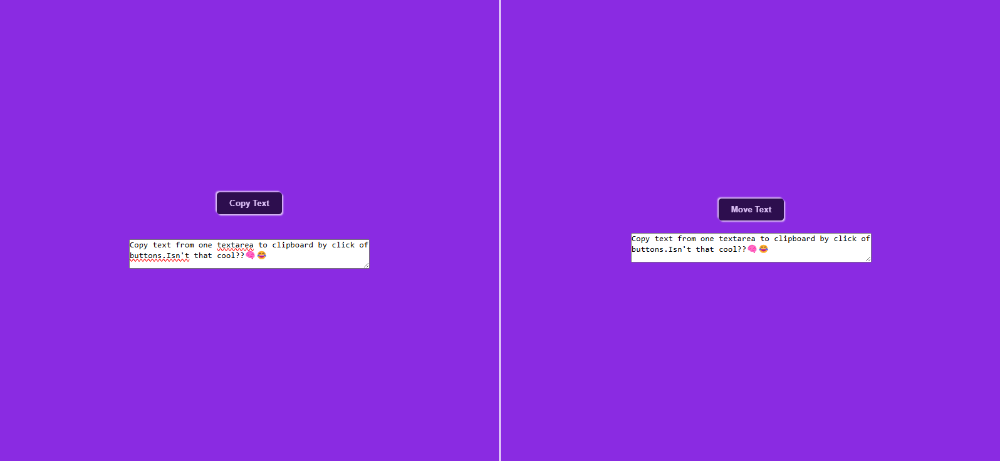

# copy-and-move-text
A simple JavaScript project that allows users to copy text from one textarea to another and provides visual feedback when copied.
# Copy and Move Text



A simple JavaScript project that allows users to **copy text** from one textarea to another and provides **visual feedback** when text is copied.

## Features

- Copy text from one textarea to clipboard.
- Move text from one textarea to another with a button click.
- Visual notification when text is successfully copied.
- Click on textareas to automatically select all text.

## How to Use

1. Type or paste some text into the first textarea.
2. Click **Copy** to copy the text to your clipboard.
3. Click **Move** to move the text to the second textarea.
4. Click on any textarea to quickly select all text.

## Technologies Used

- HTML
- CSS
- JavaScript

## Example

```html
<textarea name="copyTxt"></textarea>
<button class="copyBtn">Copy</button>

<textarea name="finalTxt"></textarea>
<button class="moverBtn">Move</button>

<div class="output"></div>
